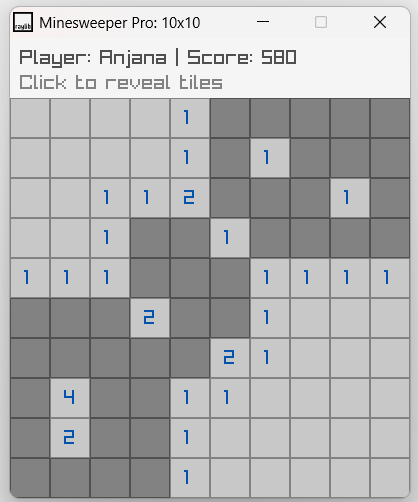
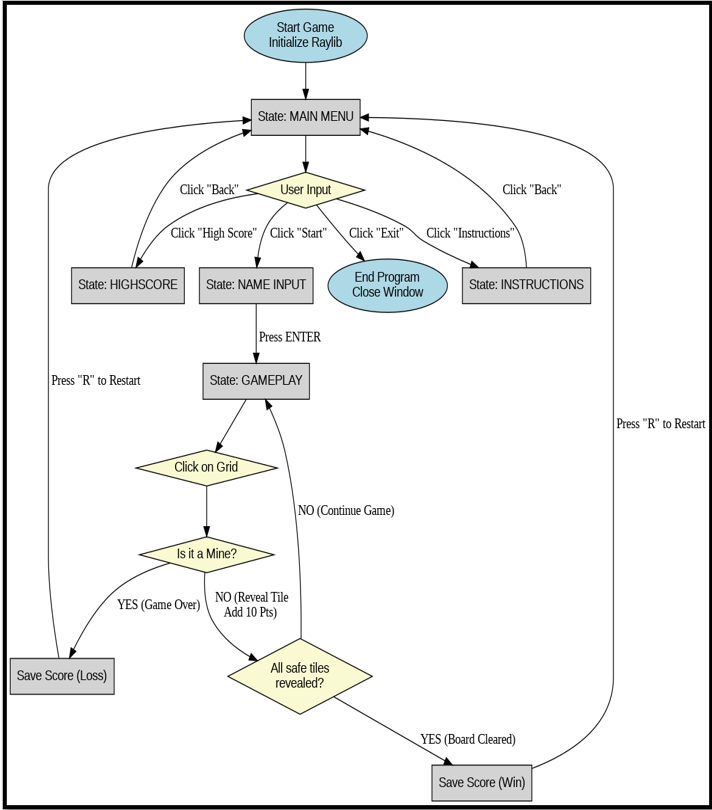

# Minesweeper Pro 💣🚩

A fully interactive, graphical implementation of the classic Minesweeper game, developed entirely in **C** using the **Raylib** library for graphics and audio handling. 



## 🛠️ Core Technical Features

This project was developed to demonstrate fundamental software engineering principles and data structures:

* **Recursive Algorithms:** Utilizes a custom flood-fill algorithm to automatically reveal adjacent safe tiles, using an `isRevealed` flag to prevent infinite loops and memory exhaustion.
* **Dynamic State Machine:** Implements strict screen routing (Menu, Gameplay, Instructions, Leaderboard) separating update logic from rendering logic to prevent graphical overlapping.
* **Data Structures & Sorting:** Reads, parses, and sorts a custom `ScoreRecord` structure using **Bubble Sort**, saving player data persistently via standard C File I/O (`<stdio.h>`).
* **Memory-Safe Audio:** Integrates `.wav` sound effects triggered by game states, dynamically loaded and safely unloaded from memory upon exit.

## 📐 System Architecture
*Below is the formal execution flow of the application:*



## 🚀 How to Run

**Prerequisites:** You must have a C compiler (like GCC) and the [Raylib library](https://www.raylib.com/) configured on your system.

1. Clone the repository:
   ```bash
   git clone [https://github.com/YourUsername/Minesweeper-C-Raylib.git](https://github.com/YourUsername/Minesweeper-C-Raylib.git)
